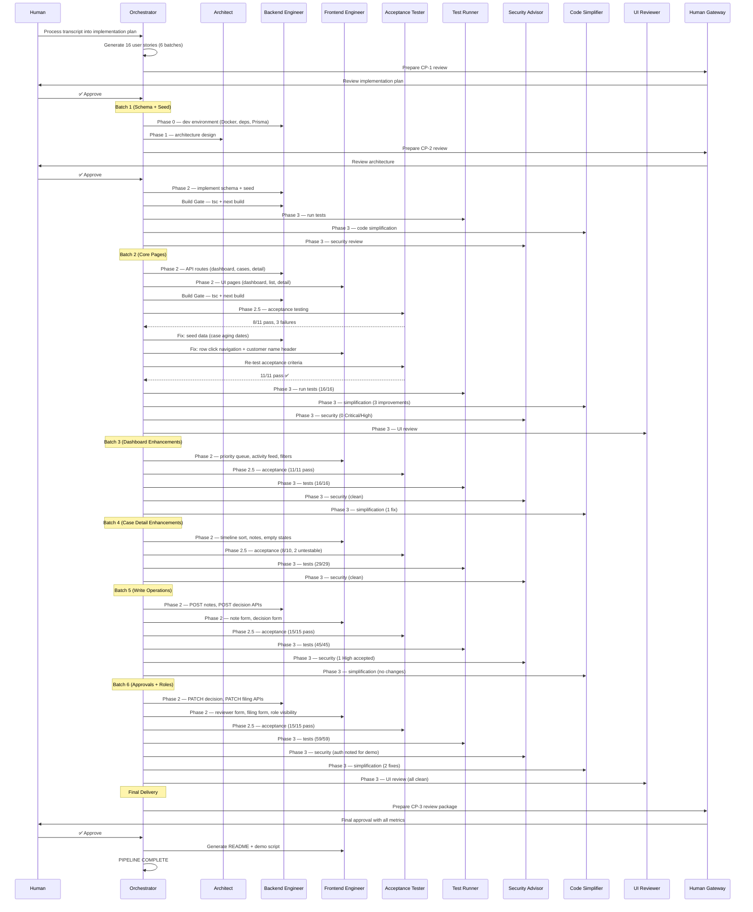
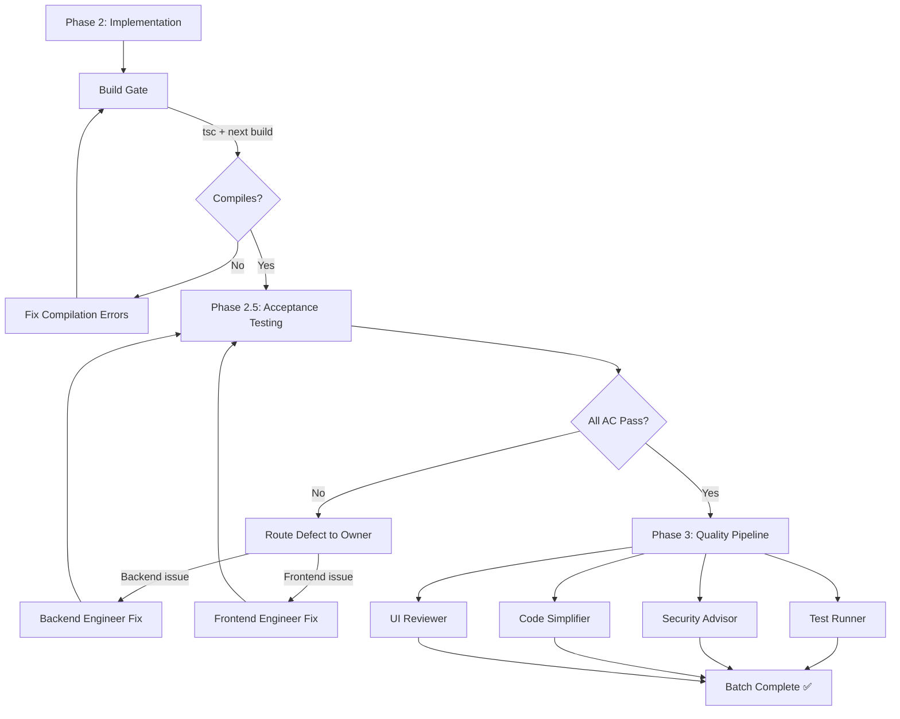

# Agent Orchestration Run Summary

## What Was Built

A complete **AML/STR Case Management Platform** — from a 60-minute meeting transcript to a fully functional web application — using AI agent orchestration.

**Input:** A business requirements transcript (fictional discovery meeting with 11 stakeholders)  
**Output:** A production-ready Next.js application with 16 user stories, 59 tests, 10 API routes, and full documentation

---

## Agents Used

| # | Agent | Role | Times Called |
|---|-------|------|:-----------:|
| 1 | **Orchestrator** | Central conductor — sequences batches, enforces phase ordering, delegates to the right agent based on task type, manages state transitions between phases | 15 |
| 2 | **Architect** | Produces the technical blueprint: Prisma data model, REST API contracts (endpoints + payloads), React component hierarchy, state machine for STR workflow, page routing map | 1 |
| 3 | **Backend Engineer** | Writes server-side code: Prisma schema + migrations, Next.js API route handlers, Zod input validation, seed scripts, and Vitest unit tests for services | 8 |
| 4 | **Frontend Engineer** | Writes client-side code: React Server/Client components, page layouts, forms, data-fetching hooks, Tailwind styling per DESIGN.md, and documentation | 8 |
| 5 | **Acceptance Tester** | Spins up the running app (next dev), writes and executes Playwright tests against each acceptance criterion, reports pass/fail per AC with evidence | 6 |
| 6 | **Test Runner** | Executes `npx vitest run` across all test files, reports pass count and any failures with stack traces — acts as the CI pipeline equivalent | 6 |
| 7 | **Security Advisor** | Reviews code against OWASP Top 10, checks for input injection, data exposure, missing auth, insecure defaults — reports findings by severity (Critical/High/Medium/Low) but cannot modify code | 6 |
| 8 | **Code Simplifier** | Reviews code with fresh eyes for unnecessary complexity: dead code, over-abstraction, nested ternaries, unused imports — applies targeted refactors and re-runs tests to verify | 5 |
| 9 | **UI Reviewer** | Validates against the design system (DESIGN.md): color tokens, spacing, typography, responsive behavior, accessibility (contrast, aria labels), interaction consistency | 2 |
| 10 | **Human Gateway** | Packages a concise decision document for the human: what was done, what's proposed next, key metrics, risks — structured to enable fast approve/reject decisions | 2 |

**Total agent invocations: 59** (counted from the completion log)

---

## Pipeline Phases Explained

Each batch follows a strict phase sequence. Here's what each phase does:

### Phase 0: Infrastructure
Set up the development environment — start PostgreSQL via Docker, install npm dependencies, generate Prisma client. Only needed once (Batch 1).

### Phase 1: Context & Architecture
The Architect agent produces the technical blueprint that all other agents reference: data model, API contracts, component hierarchy, and routing plan. Only run once (Batch 1).

### Phase 2: Implementation
Backend Engineer and Frontend Engineer work **in parallel** — one builds API routes and services, the other builds pages and components. They work from the same architecture document, so their outputs are compatible.

### Build Gate
After implementation, the orchestrator runs `tsc` (TypeScript compiler) and `next build` to verify:
- No type errors across the codebase
- No broken imports or missing modules
- Server/client component boundaries are correct
- The application compiles end-to-end

**If the build gate fails, the batch cannot proceed.** The responsible engineer must fix compilation errors before acceptance testing begins. This prevents wasting test runs on broken code.

### Phase 2.5: Acceptance Testing
The Acceptance Tester agent starts the application (`next dev`), then runs Playwright tests that validate each user story's acceptance criteria against the **running app**. This is end-to-end validation — not unit tests, but real browser-based interaction with the actual database and UI.

If any criteria fail, the orchestrator identifies which engineer owns the fix (backend vs. frontend) and routes the defect. The acceptance tester then re-runs only after the fix is applied.

### Phase 3: Quality Pipeline
Four agents run in parallel as independent quality gates:

| Gate | What it checks | Can it modify code? |
|------|---------------|:---:|
| **Test Runner** | All Vitest unit/integration tests pass | No |
| **Security Advisor** | No OWASP vulnerabilities introduced | No (report only) |
| **Code Simplifier** | No unnecessary complexity crept in | Yes (refactors) |
| **UI Reviewer** | Design system alignment, accessibility | No (report only) |

### Checkpoint (CP)
A human decision point. The Human Gateway agent prepares a review package. The human can:
- **Approve** → pipeline proceeds
- **Modify** → adjust scope, then proceed  
- **Reject** → stop and reassess

---

## Pipeline Flow

### High-Level Sequence

### Per-Batch Pipeline Diagram

---

## Key Metrics

| Metric | Value |
|--------|-------|
| Stories delivered | 16 / 16 |
| Unit tests passing | 59 / 59 |
| Acceptance criteria verified | 60 / 62 (2 untestable due to seed data gap) |
| API routes implemented | 10 |
| Database models (Prisma) | 6 |
| React components | 25+ |
| Total agent invocations | 59 |
| Human approvals (checkpoints) | 3 |
| Delivery batches | 6 |
| Defects found by acceptance tester | 3 (all auto-fixed, zero human debugging) |
| Security findings blocking release | 0 |
| Build gate failures | 0 (all batches compiled first try) |

---

## Batch-by-Batch Execution

| Batch | Stories | Key Work | Test Count | Acceptance |
|-------|---------|----------|:----------:|:----------:|
| 1 | SEED-001 | Prisma schema, migrations, seed data (5 customers, 6 cases) | — | — |
| 2 | DASH-001, LIST-001, DETAIL-001 | Dashboard summary cards, case list table, case detail page | 16 pass | 11/11 (after fix loop) |
| 3 | DASH-002, DASH-003, LIST-002 | Priority queue, activity feed, search + filters | 16 pass | 11/11 |
| 4 | DETAIL-002, DETAIL-003, NOTES-001 | Transaction timeline, notes display, empty states | 29 pass | 8/10 (2 untestable) |
| 5 | NOTES-002, STR-001, AUDIT-001 | Add notes form, STR decision form, audit log API + display | 45 pass | 15/15 |
| 6 | STR-002, STR-003, ROLE-001 | Reviewer approval, STRO filing, role-based visibility | 59 pass | 15/15 |

---

## Self-Healing Behavior

The pipeline demonstrated **autonomous defect detection and resolution** — no human was asked to debug:

### Batch 2: Acceptance Failures (3 defects)

| Failure | Root Cause | Routed To | Fix |
|---------|-----------|-----------|-----|
| Case aging shows "0 days" | Seed data used `new Date()` instead of past dates | Backend Engineer | Added explicit `createdAt` timestamps |
| Case list row click doesn't navigate | Missing `onClick` handler on table row | Frontend Engineer | Added `router.push()` on row click |
| Customer name missing from case header | Component didn't fetch joined customer data | Frontend Engineer | Added customer relation to query |

**Result:** Acceptance tester re-ran → 11/11 pass. Total time: one orchestrator cycle.

### Batch 2: UI Review Finding
- **Issue:** `NEXT_PUBLIC_BASE_URL` referenced in code but `.env` defined `NEXT_PUBLIC_APP_URL`
- **Fix:** Frontend engineer aligned the variable name

### Batch 5: Security Finding (Accepted)
- **Issue:** Audit log entries could theoretically be spoofed (no auth)
- **Decision:** Documented as accepted limitation — demo scope doesn't include authentication

### Batch 6: Code Simplification
- Removed dead utility function never called anywhere
- Replaced nested ternary with early return pattern

---

## Human Touchpoints (Only 3)

| Checkpoint | What Human Reviewed | Time to Decide | Decision |
|------------|--------------------|----|----------|
| CP-1 | Implementation plan: 16 stories, 6 batches, dependency graph | ~1 min | ✅ Approved |
| CP-2 | Architecture: data model, API contracts, component hierarchy | ~1 min | ✅ Approved |
| CP-3 | Final delivery: all metrics, test results, docs | ~1 min | ✅ Approved |

The human stayed in a **strategic approval role** — reviewing *what* to build and *whether the output meets the bar* — while agents handled all implementation, testing, and quality enforcement autonomously.
