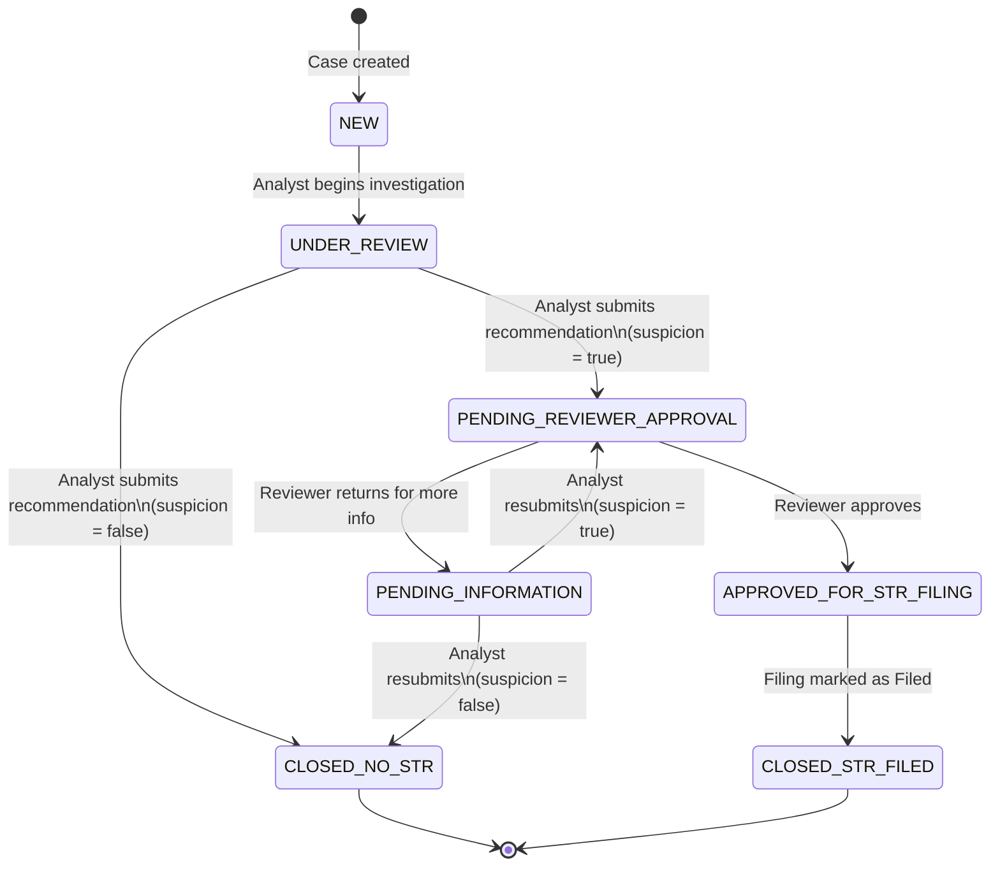
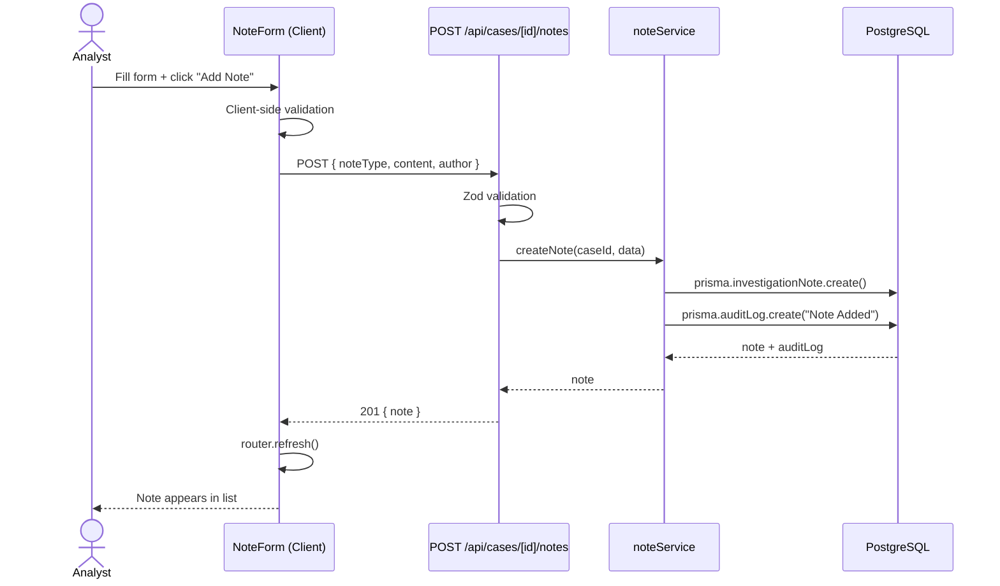
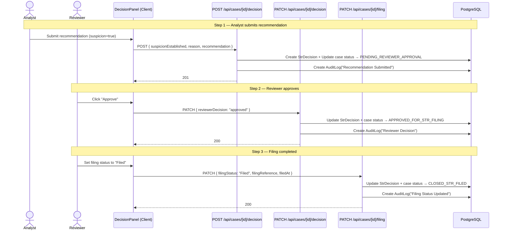

# AML/STR Case Management Platform — Technical Architecture

**Version:** 1.0  
**Date:** 4 May 2026  
**Status:** Approved for implementation  
**Scope:** Full MVP (SEED-001 through ROLE-001)

---

## 1. Feature Overview

### Goal

Build an AML/STR Case Management Platform for a Singapore-based bank. Compliance officers (Analysts, Reviewers, Operations Managers) investigate AML alerts, assess risk, document findings, decide on STR filing, and track the filing lifecycle — all backed by an immutable audit trail.

### Systems Involved

| System | Role |
|--------|------|
| Next.js App (App Router) | Server-rendered UI + API routes |
| PostgreSQL 16 | Persistent storage |
| Prisma ORM | Schema management, migrations, queries |
| Docker Compose | Local PostgreSQL instance |

### Functional Requirements

- Dashboard with summary metrics, priority queue, and activity feed
- Searchable/filterable/sortable case list
- Case detail with customer profile, transactions, risk indicators, notes, decision panel, audit log
- Append-only investigation notes with typed categories
- STR recommendation → reviewer approval → filing status workflow
- Role-based action visibility (Analyst / Reviewer / Operations Manager)
- Immutable audit log for all state changes

### Non-Functional Requirements

- Server Components by default; client components only where interactivity is required
- All API inputs validated with Zod schemas
- No real authentication — role simulated via client-side context
- No PII in application logs
- Responsive layout following CodeCademy dark design system

---

## 2. System Boundaries

### Frontend Responsibilities

- Page rendering (Server Components fetch data directly via Prisma)
- Client-side role context (React Context)
- Form validation (client + server)
- Optimistic UI updates where appropriate
- URL-based state for search/filter/sort (query params)

### Backend Responsibilities (API Routes)

- Input validation (Zod)
- Business rule enforcement (status transitions, role checks)
- Database mutations via Prisma
- Audit log creation on every state change
- Structured JSON error responses

### Data Ownership

| Entity | Owner |
|--------|-------|
| Customer | Seed data (read-only in MVP) |
| AmlCase | API routes (status transitions) |
| Transaction | Seed data (read-only in MVP) |
| InvestigationNote | POST /api/cases/[id]/notes |
| StrDecision | POST + PATCH /api/cases/[id]/decision, PATCH /api/cases/[id]/filing |
| AuditLog | System-created (append-only, never mutated) |

---

## 3. API Contracts

### 3.1 GET /api/dashboard/summary

```
Endpoint: GET /api/dashboard/summary
Purpose: Aggregate metrics for the dashboard page
Auth: public (no auth in MVP)

Request Body: none
Query Params: none

Response 200:
{
  totalOpenCases: number;
  highRiskCases: number;          // riskScore >= 76
  pendingReviewerApproval: number;
  pendingStrFiling: number;       // status = "Approved for STR Filing"
  averageCaseAgeDays: number;
  oldestCaseAgeDays: number;
  priorityCases: Array<{
    id: string;
    caseNumber: string;
    customerName: string;
    riskScore: number;
    status: CaseStatus;
    createdAt: string;            // ISO 8601
  }>;                             // top 5 by riskScore DESC
  recentActivity: Array<{
    id: string;
    caseId: string;
    caseNumber: string;
    actor: string;
    action: string;
    details: string;
    timestamp: string;            // ISO 8601
  }>;                             // latest 10
}

Response 500:
{ error: string }
```

### 3.2 GET /api/cases

```
Endpoint: GET /api/cases
Purpose: List all cases with search, filter, and sort
Auth: public

Query Params:
  search?: string           // partial match on caseNumber or customer.name
  status?: CaseStatus       // exact match
  riskRating?: RiskRating   // exact match on customer.riskRating
  sortBy?: "riskScore" | "updatedAt"   // default: "updatedAt"
  sortOrder?: "asc" | "desc"           // default: "desc"

Response 200:
{
  cases: Array<{
    id: string;
    caseNumber: string;
    customer: {
      id: string;
      name: string;
      type: CustomerType;
      riskRating: RiskRating;
    };
    alertType: string;
    riskScore: number;
    totalAmount: number;
    status: CaseStatus;
    assignedAnalyst: string;
    updatedAt: string;
  }>;
}

Response 500:
{ error: string }
```

### 3.3 GET /api/cases/[id]

```
Endpoint: GET /api/cases/[id]
Purpose: Full case detail with all relations
Auth: public

Path Params:
  id: string (cuid)

Response 200:
{
  id: string;
  caseNumber: string;
  status: CaseStatus;
  riskScore: number;
  alertType: string;
  alertReason: string;
  riskIndicators: string[];
  totalAmount: number;
  assignedAnalyst: string;
  createdAt: string;
  updatedAt: string;
  customer: {
    id: string;
    name: string;
    type: CustomerType;
    riskRating: RiskRating;
    businessActivity: string;
    accountOpenDate: string;
    sourceOfWealth: string;
    nationality: string;
  };
  transactions: Array<{
    id: string;
    direction: TransactionDirection;
    amount: number;
    currency: string;
    counterparty: string;
    country: string;
    date: string;
    purpose: string;
  }>;
  notes: Array<{
    id: string;
    noteType: NoteType;
    author: string;
    content: string;
    createdAt: string;
  }>;
  decision: {
    id: string;
    suspicionEstablished: boolean | null;
    suspicionReason: string | null;
    analystRecommendation: string | null;
    reviewerDecision: string | null;
    reviewerComment: string | null;
    filingStatus: FilingStatus;
    filingReference: string | null;
    filedAt: string | null;
  } | null;
  auditLog: Array<{
    id: string;
    actor: string;
    action: string;
    details: string;
    timestamp: string;
  }>;
}

Response 404:
{ error: "Case not found" }

Response 500:
{ error: string }
```

### 3.4 POST /api/cases/[id]/notes

```
Endpoint: POST /api/cases/[id]/notes
Purpose: Add an investigation note (append-only)
Auth: public (role checked client-side in MVP)

Path Params:
  id: string (cuid)

Request Body (Zod-validated):
{
  noteType: NoteType;       // enum: see data model
  content: string;          // min length 1
  author: string;           // current user display name
}

Response 201:
{
  id: string;
  caseId: string;
  noteType: NoteType;
  author: string;
  content: string;
  createdAt: string;
}

Response 400:
{ error: string; details?: ZodIssue[] }

Response 404:
{ error: "Case not found" }
```

**Side effects:** Creates AuditLog entry with action `"Note Added"`.

### 3.5 POST /api/cases/[id]/decision

```
Endpoint: POST /api/cases/[id]/decision
Purpose: Analyst submits STR recommendation
Auth: public (Analyst role expected)

Path Params:
  id: string (cuid)

Request Body (Zod-validated):
{
  suspicionEstablished: boolean;
  suspicionReason: string;           // min length 1
  analystRecommendation: string;     // min length 1
}

Response 201:
{
  id: string;
  caseId: string;
  suspicionEstablished: boolean;
  suspicionReason: string;
  analystRecommendation: string;
  filingStatus: FilingStatus;
}

Response 400:
{ error: string; details?: ZodIssue[] }

Response 404:
{ error: "Case not found" }

Response 409:
{ error: "Case is not in a valid status for recommendation submission" }
```

**Business rules:**
- Case must be in `UNDER_REVIEW` or `PENDING_INFORMATION` status
- If `suspicionEstablished === true` → status changes to `PENDING_REVIEWER_APPROVAL`
- If `suspicionEstablished === false` → status changes to `CLOSED_NO_STR`
- Creates AuditLog entry with action `"Recommendation Submitted"`

### 3.6 PATCH /api/cases/[id]/decision

```
Endpoint: PATCH /api/cases/[id]/decision
Purpose: Reviewer approves or returns recommendation
Auth: public (Reviewer role expected)

Path Params:
  id: string (cuid)

Request Body (Zod-validated):
{
  reviewerDecision: "approved" | "returned";
  reviewerComment?: string;   // required when decision = "returned"
}

Response 200:
{
  id: string;
  caseId: string;
  reviewerDecision: string;
  reviewerComment: string | null;
}

Response 400:
{ error: string; details?: ZodIssue[] }

Response 404:
{ error: "Case not found" }

Response 409:
{ error: "Case is not in Pending Reviewer Approval status" }
```

**Business rules:**
- Case must be in `PENDING_REVIEWER_APPROVAL` status
- If `approved` → status changes to `APPROVED_FOR_STR_FILING`, filingStatus → `NOT_STARTED`
- If `returned` → status changes to `PENDING_INFORMATION`, `reviewerComment` required
- Creates AuditLog entry with action `"Reviewer Decision"`

### 3.7 PATCH /api/cases/[id]/filing

```
Endpoint: PATCH /api/cases/[id]/filing
Purpose: Update STR filing lifecycle status
Auth: public (Reviewer role expected)

Path Params:
  id: string (cuid)

Request Body (Zod-validated):
{
  filingStatus: FilingStatus;         // "Drafting" | "Ready for Filing" | "Filed"
  filingReference?: string;           // required when filingStatus = "Filed"
  filedAt?: string;                   // ISO 8601, required when filingStatus = "Filed"
}

Response 200:
{
  id: string;
  caseId: string;
  filingStatus: FilingStatus;
  filingReference: string | null;
  filedAt: string | null;
}

Response 400:
{ error: string; details?: ZodIssue[] }

Response 404:
{ error: "Case not found" }

Response 409:
{ error: "Case is not in Approved for STR Filing status" }
```

**Business rules:**
- Case must be in `APPROVED_FOR_STR_FILING` status
- When `filingStatus === "Filed"` → `filingReference` and `filedAt` are required; case status changes to `CLOSED_STR_FILED`
- Creates AuditLog entry with action `"Filing Status Updated"`

---

## 4. Data Model

### 4.1 Enums

```prisma
enum CustomerType {
  INDIVIDUAL
  CORPORATE
}

enum RiskRating {
  LOW
  MEDIUM
  HIGH
}

enum CaseStatus {
  NEW
  UNDER_REVIEW
  PENDING_INFORMATION
  PENDING_REVIEWER_APPROVAL
  APPROVED_FOR_STR_FILING
  CLOSED_NO_STR
  CLOSED_STR_FILED
}

enum TransactionDirection {
  INCOMING
  OUTGOING
}

enum NoteType {
  CUSTOMER_PROFILE_REVIEW
  TRANSACTION_REVIEW
  COUNTERPARTY_REVIEW
  CUSTOMER_OUTREACH
  DECISION_RATIONALE
}

enum FilingStatus {
  NOT_STARTED
  DRAFTING
  READY_FOR_FILING
  FILED
}
```

### 4.2 Prisma Schema

```prisma
generator client {
  provider = "prisma-client-js"
}

datasource db {
  provider = "postgresql"
  url      = env("DATABASE_URL")
}

// ─── Enums ───────────────────────────────────────────────

enum CustomerType {
  INDIVIDUAL
  CORPORATE
}

enum RiskRating {
  LOW
  MEDIUM
  HIGH
}

enum CaseStatus {
  NEW
  UNDER_REVIEW
  PENDING_INFORMATION
  PENDING_REVIEWER_APPROVAL
  APPROVED_FOR_STR_FILING
  CLOSED_NO_STR
  CLOSED_STR_FILED
}

enum TransactionDirection {
  INCOMING
  OUTGOING
}

enum NoteType {
  CUSTOMER_PROFILE_REVIEW
  TRANSACTION_REVIEW
  COUNTERPARTY_REVIEW
  CUSTOMER_OUTREACH
  DECISION_RATIONALE
}

enum FilingStatus {
  NOT_STARTED
  DRAFTING
  READY_FOR_FILING
  FILED
}

// ─── Models ──────────────────────────────────────────────

model Customer {
  id               String       @id @default(cuid())
  name             String
  type             CustomerType
  riskRating       RiskRating
  businessActivity String
  accountOpenDate  DateTime
  sourceOfWealth   String
  nationality      String
  createdAt        DateTime     @default(now())
  updatedAt        DateTime     @updatedAt

  cases            AmlCase[]

  @@map("customers")
}

model AmlCase {
  id               String     @id @default(cuid())
  caseNumber       String     @unique
  customerId       String
  status           CaseStatus @default(NEW)
  riskScore        Int        // 0-100
  alertType        String
  alertReason      String
  riskIndicators   Json       // string[]
  totalAmount      Float
  assignedAnalyst  String
  createdAt        DateTime   @default(now())
  updatedAt        DateTime   @updatedAt

  customer         Customer            @relation(fields: [customerId], references: [id])
  transactions     Transaction[]
  notes            InvestigationNote[]
  decision         StrDecision?
  auditLog         AuditLog[]

  @@index([status])
  @@index([riskScore])
  @@index([customerId])
  @@map("aml_cases")
}

model Transaction {
  id           String               @id @default(cuid())
  caseId       String
  direction    TransactionDirection
  amount       Float
  currency     String               @default("SGD")
  counterparty String
  country      String
  date         DateTime
  purpose      String
  createdAt    DateTime             @default(now())

  case         AmlCase              @relation(fields: [caseId], references: [id])

  @@index([caseId])
  @@map("transactions")
}

model InvestigationNote {
  id        String   @id @default(cuid())
  caseId    String
  noteType  NoteType
  author    String
  content   String
  createdAt DateTime @default(now())

  case      AmlCase  @relation(fields: [caseId], references: [id])

  @@index([caseId])
  @@map("investigation_notes")
}

model StrDecision {
  id                     String       @id @default(cuid())
  caseId                 String       @unique
  suspicionEstablished   Boolean?
  suspicionReason        String?
  analystRecommendation  String?
  reviewerDecision       String?      // "approved" | "returned"
  reviewerComment        String?
  filingStatus           FilingStatus @default(NOT_STARTED)
  filingReference        String?
  filedAt                DateTime?
  createdAt              DateTime     @default(now())
  updatedAt              DateTime     @updatedAt

  case                   AmlCase      @relation(fields: [caseId], references: [id])

  @@map("str_decisions")
}

model AuditLog {
  id        String   @id @default(cuid())
  caseId    String
  actor     String
  action    String
  details   String
  timestamp DateTime @default(now())

  case      AmlCase  @relation(fields: [caseId], references: [id])

  @@index([caseId])
  @@index([timestamp])
  @@map("audit_log")
}
```

### 4.3 Entity-Relationship Diagram

```mermaid
erDiagram
    Customer ||--o{ AmlCase : "has"
    AmlCase ||--o{ Transaction : "contains"
    AmlCase ||--o{ InvestigationNote : "has"
    AmlCase ||--o| StrDecision : "has"
    AmlCase ||--o{ AuditLog : "tracks"

    Customer {
        string id PK
        string name
        CustomerType type
        RiskRating riskRating
        string businessActivity
        datetime accountOpenDate
        string sourceOfWealth
        string nationality
    }

    AmlCase {
        string id PK
        string caseNumber UK
        string customerId FK
        CaseStatus status
        int riskScore
        string alertType
        string alertReason
        json riskIndicators
        float totalAmount
        string assignedAnalyst
        datetime createdAt
        datetime updatedAt
    }

    Transaction {
        string id PK
        string caseId FK
        TransactionDirection direction
        float amount
        string currency
        string counterparty
        string country
        datetime date
        string purpose
    }

    InvestigationNote {
        string id PK
        string caseId FK
        NoteType noteType
        string author
        string content
        datetime createdAt
    }

    StrDecision {
        string id PK
        string caseId FK_UK
        boolean suspicionEstablished
        string suspicionReason
        string analystRecommendation
        string reviewerDecision
        string reviewerComment
        FilingStatus filingStatus
        string filingReference
        datetime filedAt
    }

    AuditLog {
        string id PK
        string caseId FK
        string actor
        string action
        string details
        datetime timestamp
    }
```

### 4.4 Indexes and Constraints

| Model | Index/Constraint | Fields | Rationale |
|-------|-----------------|--------|-----------|
| AmlCase | unique | `caseNumber` | Human-readable case identifier |
| AmlCase | index | `status` | Filter by status on list + dashboard |
| AmlCase | index | `riskScore` | Sort by risk on priority queue |
| AmlCase | index | `customerId` | FK lookup |
| Transaction | index | `caseId` | Relation lookup |
| InvestigationNote | index | `caseId` | Relation lookup |
| StrDecision | unique | `caseId` | One decision per case |
| AuditLog | index | `caseId` | Relation lookup |
| AuditLog | index | `timestamp` | Recent activity query |

---

## 5. Authentication & Authorization

### MVP Approach (No Real Auth)

Authentication is **simulated** via a client-side role selector. There is no login flow, JWT, or session management.

| Concept | Implementation |
|---------|---------------|
| Current role | React Context (`RoleContext`) with `useState` |
| Persistence | None (resets on refresh) — default: `Analyst` |
| Role switching | Dropdown in the app header |
| API enforcement | None — API routes trust the client. Role is passed as metadata where needed (e.g., `author` on notes). |

### Role Capabilities

| Action | Analyst | Reviewer | Operations Manager |
|--------|---------|----------|--------------------|
| View dashboard | ✓ | ✓ | ✓ |
| View case list | ✓ | ✓ | ✓ |
| View case detail | ✓ | ✓ | ✓ |
| Add investigation note | ✓ | ✓ | ✗ |
| Submit STR recommendation | ✓ | ✗ | ✗ |
| Approve / return recommendation | ✗ | ✓ | ✗ |
| Update filing status | ✗ | ✓ | ✗ |

### UI Enforcement

Components check the current role from `RoleContext` and conditionally render action buttons. API routes do **not** enforce roles in the MVP — this is documented as a known limitation.

---

## 6. Status Transitions (State Machine)

### Case Status State Machine



### Valid Transitions Table

| From | To | Trigger | Actor |
|------|----|---------|-------|
| `NEW` | `UNDER_REVIEW` | Analyst opens case / adds first note | Analyst |
| `UNDER_REVIEW` | `PENDING_REVIEWER_APPROVAL` | Recommendation submitted (suspicion = true) | Analyst |
| `UNDER_REVIEW` | `CLOSED_NO_STR` | Recommendation submitted (suspicion = false) | Analyst |
| `PENDING_INFORMATION` | `PENDING_REVIEWER_APPROVAL` | Recommendation resubmitted (suspicion = true) | Analyst |
| `PENDING_INFORMATION` | `CLOSED_NO_STR` | Recommendation resubmitted (suspicion = false) | Analyst |
| `PENDING_REVIEWER_APPROVAL` | `APPROVED_FOR_STR_FILING` | Reviewer approves | Reviewer |
| `PENDING_REVIEWER_APPROVAL` | `PENDING_INFORMATION` | Reviewer returns for more info | Reviewer |
| `APPROVED_FOR_STR_FILING` | `CLOSED_STR_FILED` | Filing status set to Filed | Reviewer |

### Filing Status Transitions

| From | To | Trigger |
|------|----|---------|
| `NOT_STARTED` | `DRAFTING` | Reviewer begins drafting |
| `DRAFTING` | `READY_FOR_FILING` | Draft completed |
| `READY_FOR_FILING` | `FILED` | Filed with STRO (requires reference + date) |

### Risk Score Bands

| Band | Score Range | Label |
|------|-------------|-------|
| Low | 0–25 | `LOW` |
| Medium | 26–50 | `MEDIUM` |
| High | 51–75 | `HIGH` |
| Critical | 76–100 | `CRITICAL` |

---

## 7. Routing (App Router File Structure)

```
app/
├── layout.tsx                          ← Root layout (RoleProvider, nav, fonts)
├── page.tsx                            ← Redirect to /dashboard or render dashboard
├── (dashboard)/
│   └── page.tsx                        ← Dashboard (summary cards, priority queue, activity)
├── cases/
│   ├── page.tsx                        ← Case list (search, filter, sort)
│   ├── loading.tsx                     ← Case list skeleton
│   └── [id]/
│       ├── page.tsx                    ← Case detail
│       ├── loading.tsx                 ← Case detail skeleton
│       └── not-found.tsx              ← 404 for invalid case ID
├── api/
│   ├── dashboard/
│   │   └── summary/
│   │       └── route.ts               ← GET /api/dashboard/summary
│   └── cases/
│       ├── route.ts                    ← GET /api/cases
│       └── [id]/
│           ├── route.ts               ← GET /api/cases/[id]
│           ├── notes/
│           │   └── route.ts           ← POST /api/cases/[id]/notes
│           ├── decision/
│           │   └── route.ts           ← POST + PATCH /api/cases/[id]/decision
│           └── filing/
│               └── route.ts           ← PATCH /api/cases/[id]/filing
└── globals.css                         ← Tailwind base + design tokens
```

---

## 8. Component Structure

### 8.1 Component Hierarchy

```
app/layout.tsx
├── RoleProvider (client)
│   └── AppShell
│       ├── Header
│       │   ├── Logo / Title
│       │   └── RoleSelector (client)
│       ├── Sidebar / Nav
│       └── {children}

app/(dashboard)/page.tsx (server)
└── DashboardPage
    ├── DashboardCards
    │   ├── SummaryCard (Total Open)
    │   ├── SummaryCard (High Risk)
    │   ├── SummaryCard (Pending Approval)
    │   └── SummaryCard (Pending Filing)
    ├── PriorityCaseQueue
    │   └── PriorityCaseRow (×5)
    └── RecentActivityFeed
        └── ActivityEntry (×10)

app/cases/page.tsx (server)
└── CaseListPage
    ├── CaseSearchBar (client)
    ├── CaseFilters (client)
    │   ├── StatusFilter
    │   └── RiskRatingFilter
    ├── CaseTable
    │   └── CaseRow (×n) → link to /cases/[id]
    └── EmptyState

app/cases/[id]/page.tsx (server)
└── CaseDetailPage
    ├── CaseHeader
    │   ├── CaseNumber + StatusBadge
    │   └── RiskScoreBadge
    ├── CustomerProfilePanel
    ├── AlertSummaryPanel
    ├── TransactionTimeline
    │   └── TransactionRow (×n)
    ├── RiskIndicatorsList
    ├── InvestigationNotesPanel
    │   ├── NoteCard (×n)
    │   └── NoteForm (client)
    ├── DecisionPanel (client)
    │   ├── AnalystRecommendationForm
    │   ├── ReviewerDecisionForm
    │   └── FilingStatusForm
    └── AuditLogPanel
        └── AuditLogEntry (×n)
```

### 8.2 Key Components

| Component | Type | Location | Purpose |
|-----------|------|----------|---------|
| `RoleProvider` | Client | `components/providers/role-provider.tsx` | React Context for current role |
| `RoleSelector` | Client | `components/role-selector.tsx` | Dropdown to switch roles |
| `DashboardCards` | Server | `components/dashboard/dashboard-cards.tsx` | Summary metric cards |
| `PriorityCaseQueue` | Server | `components/dashboard/priority-case-queue.tsx` | Top-5 high-risk cases |
| `RecentActivityFeed` | Server | `components/dashboard/recent-activity-feed.tsx` | Latest 10 audit entries |
| `CaseTable` | Server | `components/cases/case-table.tsx` | Sortable case list table |
| `CaseSearchBar` | Client | `components/cases/case-search-bar.tsx` | Search input with debounce |
| `CaseFilters` | Client | `components/cases/case-filters.tsx` | Status + risk rating filters |
| `CustomerProfilePanel` | Server | `components/case-detail/customer-profile-panel.tsx` | Customer info display |
| `TransactionTimeline` | Server | `components/case-detail/transaction-timeline.tsx` | Chronological transactions |
| `RiskIndicatorsList` | Server | `components/case-detail/risk-indicators-list.tsx` | Risk indicator badges |
| `InvestigationNotesPanel` | Server | `components/case-detail/investigation-notes-panel.tsx` | Notes list wrapper |
| `NoteForm` | Client | `components/case-detail/note-form.tsx` | Add note form |
| `DecisionPanel` | Client | `components/case-detail/decision-panel.tsx` | STR recommendation + review |
| `AuditLogPanel` | Server | `components/case-detail/audit-log-panel.tsx` | Audit trail display |
| `StatusBadge` | Server | `components/ui/status-badge.tsx` | Case status chip |
| `RiskScoreBadge` | Server | `components/ui/risk-score-badge.tsx` | Color-coded risk score |

---

## 9. State Management

### Server-Side Data Fetching

Server Components fetch data directly via Prisma (through service functions in `services/`). No client-side data fetching library is needed for read operations.

```
Page (Server Component)
  → calls service function
    → Prisma query
      → returns typed data
        → passes as props to child components
```

### Client-Side State

| State | Mechanism | Scope |
|-------|-----------|-------|
| Current role | `RoleContext` (React Context + `useState`) | Global |
| Search query | URL search params (`useSearchParams`) | Case list page |
| Filter values | URL search params | Case list page |
| Sort column/order | URL search params | Case list page |
| Form state | Local `useState` in form components | Component-level |

### Data Mutation Pattern

Client components call API routes via `fetch`, then use `router.refresh()` to revalidate Server Component data:

```
Client Component (form submit)
  → fetch("POST /api/cases/[id]/notes", { body })
    → API route validates + mutates
      → returns response
        → router.refresh() triggers Server Component re-render
```

---

## 10. Sequence Diagrams

### 10.1 Add Investigation Note



### 10.2 STR Recommendation → Approval → Filing



---

## 11. Affected Files

### Prisma & Database

| Action | File |
|--------|------|
| Create | `prisma/schema.prisma` |
| Create | `prisma/seed.ts` |

### Lib / Shared

| Action | File |
|--------|------|
| Create | `lib/prisma.ts` — Singleton Prisma client |
| Create | `lib/types.ts` — Shared TypeScript interfaces |
| Create | `lib/validations.ts` — Zod schemas for API inputs |
| Create | `lib/constants.ts` — Risk thresholds, status labels |

### Services (Business Logic)

| Action | File |
|--------|------|
| Create | `services/dashboard-service.ts` |
| Create | `services/case-service.ts` |
| Create | `services/note-service.ts` |
| Create | `services/decision-service.ts` |
| Create | `services/audit-service.ts` |

### API Routes

| Action | File |
|--------|------|
| Create | `app/api/dashboard/summary/route.ts` |
| Create | `app/api/cases/route.ts` |
| Create | `app/api/cases/[id]/route.ts` |
| Create | `app/api/cases/[id]/notes/route.ts` |
| Create | `app/api/cases/[id]/decision/route.ts` |
| Create | `app/api/cases/[id]/filing/route.ts` |

### Pages

| Action | File |
|--------|------|
| Create | `app/layout.tsx` |
| Create | `app/globals.css` |
| Create | `app/(dashboard)/page.tsx` |
| Create | `app/cases/page.tsx` |
| Create | `app/cases/loading.tsx` |
| Create | `app/cases/[id]/page.tsx` |
| Create | `app/cases/[id]/loading.tsx` |
| Create | `app/cases/[id]/not-found.tsx` |

### Components

| Action | File |
|--------|------|
| Create | `components/providers/role-provider.tsx` |
| Create | `components/role-selector.tsx` |
| Create | `components/app-shell.tsx` |
| Create | `components/dashboard/dashboard-cards.tsx` |
| Create | `components/dashboard/priority-case-queue.tsx` |
| Create | `components/dashboard/recent-activity-feed.tsx` |
| Create | `components/cases/case-table.tsx` |
| Create | `components/cases/case-search-bar.tsx` |
| Create | `components/cases/case-filters.tsx` |
| Create | `components/case-detail/customer-profile-panel.tsx` |
| Create | `components/case-detail/alert-summary-panel.tsx` |
| Create | `components/case-detail/transaction-timeline.tsx` |
| Create | `components/case-detail/risk-indicators-list.tsx` |
| Create | `components/case-detail/investigation-notes-panel.tsx` |
| Create | `components/case-detail/note-form.tsx` |
| Create | `components/case-detail/decision-panel.tsx` |
| Create | `components/case-detail/audit-log-panel.tsx` |
| Create | `components/ui/status-badge.tsx` |
| Create | `components/ui/risk-score-badge.tsx` |

### Config

| Action | File |
|--------|------|
| Create | `package.json` |
| Create | `tsconfig.json` |
| Create | `next.config.ts` |
| Create | `tailwind.config.ts` |
| Create | `postcss.config.mjs` |
| Create | `vitest.config.ts` |
| Create | `playwright.config.ts` |

---

## 12. Technical Decisions

### Decision 1: Server Components for Data Display

| | |
|-|-|
| **Decision** | Use React Server Components for all read-only data display; client components only for forms and interactive controls |
| **Alternatives** | (A) Full client-side with React Query, (B) Full SSR with no client components |
| **Rationale** | Server Components reduce bundle size and eliminate client-side loading states for initial render. Forms and role switching require interactivity, so they use `"use client"`. |
| **Trade-off** | `router.refresh()` after mutations is less granular than React Query cache invalidation, but simpler for MVP scope. |

### Decision 2: URL-Based Filter State

| | |
|-|-|
| **Decision** | Store search, filter, and sort state in URL search params |
| **Alternatives** | (A) React state only, (B) Zustand store |
| **Rationale** | URL params make filtered views shareable/bookmarkable, survive page refreshes, and integrate naturally with Server Component data fetching. |
| **Trade-off** | Slightly more wiring than local state, but standard Next.js pattern. |

### Decision 3: Single Prisma Client Singleton

| | |
|-|-|
| **Decision** | Use `lib/prisma.ts` with global singleton pattern to avoid connection exhaustion in dev |
| **Alternatives** | (A) New client per request, (B) Connection pooling library |
| **Rationale** | Standard Next.js + Prisma pattern. Next.js dev server hot-reloads, creating new clients each time without the singleton guard. |
| **Trade-off** | None significant for MVP. |

### Decision 4: Service Layer Between API Routes and Prisma

| | |
|-|-|
| **Decision** | Business logic lives in `services/*.ts`; API routes handle HTTP concerns (parsing, validation, response formatting) |
| **Alternatives** | (A) Logic directly in route handlers |
| **Rationale** | Separation makes services testable with Vitest without HTTP mocking. Routes stay thin. |
| **Trade-off** | Extra files, but proportional to feature count. |

### Decision 5: JSON Column for Risk Indicators

| | |
|-|-|
| **Decision** | Store `riskIndicators` as a Prisma `Json` field (PostgreSQL JSONB) |
| **Alternatives** | (A) Separate `RiskIndicator` model with FK |
| **Rationale** | Risk indicators are read-only string arrays in MVP — no querying/filtering by individual indicator. JSONB avoids an extra table and join for a simple list. |
| **Trade-off** | Cannot index individual indicators. Acceptable for MVP read-only usage. |

### Decision 6: Float for Monetary Amounts

| | |
|-|-|
| **Decision** | Use `Float` for `totalAmount` and transaction `amount` in Prisma |
| **Alternatives** | (A) `Decimal` type, (B) Integer cents |
| **Rationale** | This is a demo/investigation platform, not a ledger. Amounts are display-only — no arithmetic that would cause floating-point issues. Simplifies seed data. |
| **Trade-off** | Not suitable for production financial calculations. Documented as known limitation. |

---

## 13. Implementation Sequence

### Batch 1 — Foundation (SEED-001)

**Backend engineer starts:**
1. Initialize Next.js project with TypeScript, Tailwind, shadcn/ui
2. Create `prisma/schema.prisma` (exact schema from §4.2)
3. Run `npx prisma migrate dev` to create tables
4. Create `lib/prisma.ts` singleton
5. Create `prisma/seed.ts` with all seed data (see §14)
6. Verify seed with `npx prisma db seed`

### Batch 2 — Core Navigation (DASH-001, LIST-001, DETAIL-001)

**Backend starts:**
1. `services/dashboard-service.ts` — aggregation queries
2. `services/case-service.ts` — list + detail queries
3. API routes: `GET /api/dashboard/summary`, `GET /api/cases`, `GET /api/cases/[id]`

**Frontend starts (can begin once schema exists):**
1. `app/layout.tsx` with `RoleProvider`, fonts, nav
2. Dashboard page with `DashboardCards`
3. Case list page with `CaseTable`
4. Case detail page with `CustomerProfilePanel`, `AlertSummaryPanel`

**Converge:** Frontend fetches from API routes or calls services directly in Server Components.

### Batch 3 — Dashboard + List Enhancement (DASH-002, DASH-003, LIST-002)

1. Add `PriorityCaseQueue` and `RecentActivityFeed` to dashboard
2. Add `CaseSearchBar`, `CaseFilters` to case list
3. Wire URL search params to API query params

### Batch 4 — Detail Enrichment (DETAIL-002, DETAIL-003, NOTES-001)

1. `TransactionTimeline` component
2. `RiskIndicatorsList` component
3. `InvestigationNotesPanel` (read-only)

### Batch 5 — Investigation Workflow (NOTES-002, STR-001, AUDIT-001)

**Backend:** `POST /api/cases/[id]/notes`, `POST /api/cases/[id]/decision`, audit service
**Frontend:** `NoteForm`, analyst portion of `DecisionPanel`, `AuditLogPanel`

### Batch 6 — Decision + Roles (STR-002, STR-003, ROLE-001)

**Backend:** `PATCH /api/cases/[id]/decision`, `PATCH /api/cases/[id]/filing`
**Frontend:** Reviewer portion of `DecisionPanel`, `FilingStatusForm`, `RoleSelector` with conditional rendering

---

## 14. Seed Data Plan

### 14.1 Customers (5)

| # | Name | Type | Risk Rating | Business Activity | Nationality |
|---|------|------|-------------|-------------------|-------------|
| 1 | Meridian Star Trading Pte Ltd | CORPORATE | HIGH | Import/Export Trading | Singapore |
| 2 | Lim Wei Hao | INDIVIDUAL | MEDIUM | Private Banking Client | Singapore |
| 3 | Eastern Horizon Imports Pte Ltd | CORPORATE | HIGH | Wholesale Import/Distribution | Malaysia |
| 4 | Asha Global Services Ltd | CORPORATE | LOW | IT Consulting Services | India |
| 5 | Tan Rui En | INDIVIDUAL | MEDIUM | Retail Banking Client | Singapore |

### 14.2 Cases (6)

| # | Case Number | Customer | Status | Risk Score | Alert Type | Assigned Analyst |
|---|-------------|----------|--------|------------|------------|------------------|
| 1 | AML-2026-0017 | Meridian Star Trading | UNDER_REVIEW | 82 | Rapid Movement of Funds | Mei Ling Tan |
| 2 | AML-2026-0023 | Lim Wei Hao | NEW | 45 | Unusual Cash Deposits | Mei Ling Tan |
| 3 | AML-2026-0008 | Eastern Horizon Imports | PENDING_REVIEWER_APPROVAL | 71 | High-Risk Jurisdiction Transfers | Priya Nair |
| 4 | AML-2026-0031 | Asha Global Services | CLOSED_NO_STR | 22 | Unusual Account Activity | Mei Ling Tan |
| 5 | AML-2026-0012 | Tan Rui En | PENDING_INFORMATION | 58 | Structuring Pattern Detected | Priya Nair |
| 6 | AML-2026-0003 | Meridian Star Trading | CLOSED_STR_FILED | 91 | Layering / Shell Company Network | Mei Ling Tan |

### 14.3 Transactions (per case)

**Case 1 (AML-2026-0017) — 4+ transactions:**
- INCOMING, SGD 250,000 from Global Commodities Ltd (Hong Kong), Wire transfer for commodity purchase
- OUTGOING, SGD 245,000 to Brightway Holdings (BVI), Investment disbursement
- INCOMING, SGD 180,000 from Pacific Rim Ventures (Myanmar), Consulting fee payment
- OUTGOING, SGD 175,000 to Oceanic Trade Corp (Panama), Trade settlement

**Case 2 (AML-2026-0023) — 3 transactions:**
- INCOMING, SGD 9,800 cash deposit, Cash — personal savings
- INCOMING, SGD 9,500 cash deposit (next day), Cash — personal savings
- INCOMING, SGD 9,900 cash deposit (2 days later), Cash — business income

**Case 3 (AML-2026-0008) — 3 transactions:**
- INCOMING, USD 500,000 from Al-Rashid Trading (UAE), Goods payment
- OUTGOING, USD 480,000 to Myanmar Golden Exports (Myanmar), Supplier payment
- OUTGOING, USD 15,000 to Cayman Islands Trust Co (Cayman Islands), Trust maintenance fee

**Case 4 (AML-2026-0031) — 2 transactions:**
- INCOMING, SGD 50,000 from Asha Global HQ (India), Intercompany transfer
- OUTGOING, SGD 48,000 to vendor (Singapore), Vendor payment — IT services

**Case 5 (AML-2026-0012) — 3 transactions:**
- INCOMING, SGD 9,700 cash deposit, Cash — freelance income
- INCOMING, SGD 9,600 cash deposit, Cash — freelance income
- OUTGOING, SGD 18,000 to unknown recipient (Malaysia), Personal remittance

**Case 6 (AML-2026-0003) — 4 transactions:**
- INCOMING, USD 1,200,000 from Phoenix Ventures Ltd (BVI), Investment capital
- OUTGOING, USD 400,000 to Coral Bay Trading (Cayman Islands), Investment placement
- OUTGOING, USD 350,000 to Golden Bridge Holdings (Panama), Consulting fee
- OUTGOING, USD 420,000 to Sunrise Capital (Seychelles), Trade finance

### 14.4 Investigation Notes (for active cases)

**Case 1 (AML-2026-0017):**
- CUSTOMER_PROFILE_REVIEW: "Meridian Star Trading incorporated 2023. Director: Chen Wei Ming. Business activity listed as import/export but limited trading history verifiable."
- TRANSACTION_REVIEW: "Rapid pass-through pattern identified. Funds received and disbursed within 24-48 hours with minimal retention. Amounts just below enhanced monitoring thresholds."

**Case 3 (AML-2026-0008):**
- CUSTOMER_PROFILE_REVIEW: "Eastern Horizon Imports has frequent transactions with counterparties in FATF grey-list jurisdictions."
- COUNTERPARTY_REVIEW: "Al-Rashid Trading — limited public information. Myanmar Golden Exports — flagged in adverse media for association with sanctioned entities."
- DECISION_RATIONALE: "Recommend STR filing based on high-risk jurisdiction counterparties and layering indicators."

**Case 5 (AML-2026-0012):**
- TRANSACTION_REVIEW: "Three cash deposits in consecutive days totalling SGD 29,300. Each deposit structured below SGD 10,000 threshold."
- CUSTOMER_OUTREACH: "Contacted customer regarding source of cash deposits. Customer states freelance graphic design income. Requested supporting invoices — pending response."

**Case 6 (AML-2026-0003):**
- CUSTOMER_PROFILE_REVIEW: "Meridian Star Trading — second case for this customer. Previous case closed with STR filed."
- TRANSACTION_REVIEW: "Classic layering pattern. Large incoming from BVI entity, immediately distributed to multiple shell companies across known secrecy jurisdictions."
- DECISION_RATIONALE: "Clear layering with shell company network. STR filed with STRO via SONAR."

### 14.5 STR Decisions (where applicable)

**Case 3 (PENDING_REVIEWER_APPROVAL):**
- suspicionEstablished: true
- suspicionReason: "High-risk jurisdiction counterparties with layering indicators and adverse media on counterparty."
- analystRecommendation: "Recommend filing STR based on counterparty risk and transaction pattern analysis."
- filingStatus: NOT_STARTED

**Case 4 (CLOSED_NO_STR):**
- suspicionEstablished: false
- suspicionReason: "Transaction pattern consistent with normal intercompany operations. No adverse indicators."
- analystRecommendation: "Close case — no suspicious activity identified."
- filingStatus: NOT_STARTED

**Case 6 (CLOSED_STR_FILED):**
- suspicionEstablished: true
- suspicionReason: "Classic layering through shell company network across secrecy jurisdictions."
- analystRecommendation: "Urgent STR filing recommended — clear layering with multiple shell entities."
- reviewerDecision: "approved"
- reviewerComment: "Concur with analyst assessment. Clear ML typology. Approve for immediate filing."
- filingStatus: FILED
- filingReference: "STR-2026-SG-004821"
- filedAt: 2026-02-15

### 14.6 Audit Log Entries (representative)

Each case should have at minimum a `"Case Created"` entry. Active cases should have additional entries reflecting their investigation history:

| Case | Entries |
|------|---------|
| AML-2026-0017 | Case Created, Note Added (×2) |
| AML-2026-0023 | Case Created |
| AML-2026-0008 | Case Created, Note Added (×3), Recommendation Submitted |
| AML-2026-0031 | Case Created, Note Added, Recommendation Submitted |
| AML-2026-0012 | Case Created, Note Added (×2) |
| AML-2026-0003 | Case Created, Note Added (×3), Recommendation Submitted, Reviewer Decision, Filing Status Updated (×3) |

---

## 15. Known Limitations (MVP)

1. **No real authentication** — roles are simulated client-side
2. **No server-side role enforcement** — API routes trust the client
3. **Float for money** — not suitable for production financial calculations
4. **No pagination** — case list loads all records (acceptable for demo data volume)
5. **No real-time updates** — requires manual page refresh or `router.refresh()`
6. **No file attachments** — investigation notes are text-only
7. **No STRO/SONAR integration** — filing reference is manually entered
8. **No transaction monitoring engine** — alerts are seeded, not generated
